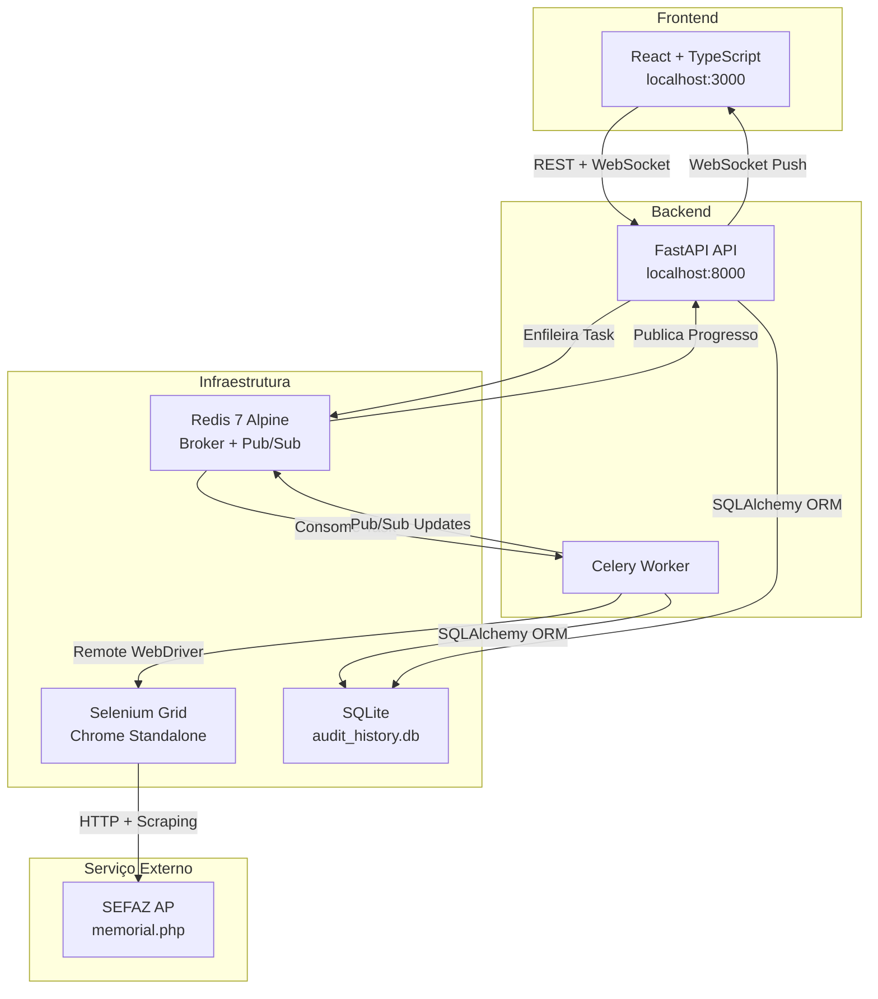
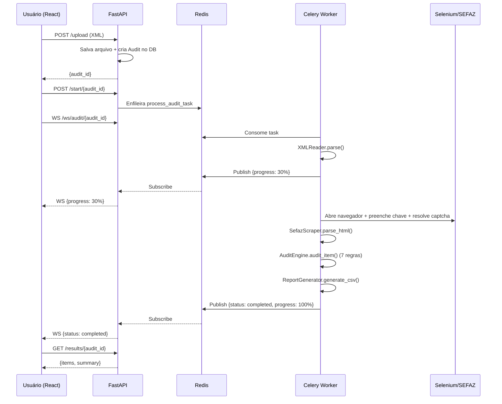

# Technical Specification (SPEC) - AuditTax AP

## 1. Arquitetura do Sistema

A solução segue uma arquitetura de **microsserviços conteinerizados** com processamento assíncrono, orquestrada via Docker Compose.

### Diagrama de Arquitetura



### Camadas do Sistema

| Camada | Componentes | Responsabilidade |
|--------|-------------|------------------|
| **Apresentação** | React (AuditInterface, ResultsTable, DashboardCharts) | Interface web, upload, visualização de resultados |
| **API** | FastAPI (routes, WebSocket) | Endpoints REST, autenticação, WebSocket |
| **Processamento** | Celery Worker (celery_worker.py) | Execução assíncrona de auditorias |
| **Serviço** | AuditService | Orquestração: XML → SEFAZ → Auditoria → Relatório |
| **Domínio** | AuditEngine, AuditRules, DTOs | Regras de negócio, validações fiscais |
| **Infraestrutura** | SeleniumDriverManager, SefazScraper, XMLReader | Interação com SEFAZ, parsing de XML/HTML |
| **Persistência** | SQLAlchemy + SQLite, ReportGenerator (CSV) | Armazenamento e geração de relatórios |

## 2. Stack Tecnológica

### Backend

| Tecnologia | Versão | Finalidade |
|------------|--------|-----------|
| Python | 3.10+ | Linguagem principal (tipagem forte obrigatória) |
| FastAPI | 0.109.0 | API REST + WebSocket |
| Celery | 5.3.6 | Processamento assíncrono de tarefas |
| Redis | 5.0.1 (client) / 7 Alpine (server) | Message broker + Pub/Sub para WebSocket |
| SQLAlchemy | 2.0.25 | ORM para persistência |
| SQLite | — | Banco de dados de auditorias |
| Selenium | 4.16.0 | Automação de navegador |
| BeautifulSoup4 | 4.12.3 | Parsing HTML da SEFAZ |
| lxml | 5.1.0 | Parsing XML de NFe |
| Tesseract OCR | (via pytesseract 0.3.10) | Resolução automática de captcha |
| Pillow | 10.2.0 | Pré-processamento de imagem para OCR |
| Pydantic | 2.5.3 | Validação de dados da API |

### Frontend

| Tecnologia | Finalidade |
|------------|-----------|
| React 18 + TypeScript | UI reativa com tipagem |
| Tailwind CSS | Estilização utilitária |
| Axios | Cliente HTTP para API |
| Lucide React | Ícones |
| Recharts | Gráficos do dashboard |
| WebSocket nativo | Progresso em tempo real |

### Infraestrutura

| Serviço | Imagem/Config | Porta |
|---------|---------------|-------|
| Backend (FastAPI) | Custom Dockerfile | 8000 |
| Worker (Celery) | Mesmo Dockerfile do backend | — |
| Frontend (React) | Nginx serve build estático | 3000 |
| Redis | redis:7-alpine | 6379 |
| Selenium Chrome | selenium/standalone-chrome:latest (2 GB shm) | 4444 |

## 3. Modelo de Dados

### Schema do Banco (SQLAlchemy)

```python
class Audit(Base):
    id: str (UUID, PK)
    nfe_key: str
    xml_path: str
    status: str  # 'pending' | 'processing' | 'completed' | 'error'
    progress: int
    current_step: str
    report_path: str | None
    error_message: str | None
    result_summary: JSON  # {total, compliant, divergent}
    created_at: datetime
    completed_at: datetime | None

class AuditItem(Base):
    id: int (PK, auto)
    audit_id: str (FK → Audit.id)
    item_index: int
    product_code: str
    product_name: str
    status: str  # 'compliant' | 'divergent'
    issues: JSON  # Lista de mensagens de divergência
```

### DTO de Item Fiscal (Memória)

```python
@dataclass
class FiscalItemDTO:
    origin: str         # 'XML' ou 'SEFAZ'
    item_index: int
    product_code: str
    ncm: str
    cest: str
    cfop: str
    cst: str
    amount_total: Decimal
    tax_base: Decimal
    tax_rate: Decimal
    tax_value: Decimal
    mva_percent: Decimal
    is_suframa_benefit: bool
```

### DTO de Resultado de Auditoria

```python
@dataclass
class AuditDifference:
    field: str          # Ex: 'NCM', 'TAX_VALUE', 'MVA %'
    xml_value: str
    sefaz_value: str
    message: str        # Ex: 'NCM divergente'

@dataclass
class AuditResultDTO:
    item_index: int
    product_code: str
    is_compliant: bool
    differences: list[AuditDifference]
```

## 4. Regras de Auditoria (Strategy Pattern)

O `AuditEngine` executa uma cadeia de regras configurável via `AuditRuleChainBuilder`:

| # | Regra | Classe | Lógica |
|---|-------|--------|--------|
| 1 | NCM | `NCMRule` | Comparação direta de strings |
| 2 | CEST | `CESTRule` | Comparação com normalização (remove pontos) |
| 3 | CFOP | `CFOPRule` | Comparação direta de strings |
| 4 | CST | `CSTRule` | Comparação com normalização (zero-fill 3 dígitos) |
| 5 | SUFRAMA | `SuframaBenefitRule` | Comparação booleana |
| 6 | Valores | `MonetaryRule` | Diferença absoluta > tolerância (padrão R$ 0,05) |
| 7 | MVA | `MVARule` | Diferença absoluta do percentual > 0,01% |

Todas implementam a interface abstrata `AuditRule.validate()`.

## 5. Resolução Automática de Captcha (OCR)

O `SeleniumDriverManager._solve_captcha()` realiza o seguinte pipeline de pré-processamento:

```
Imagem Captcha → Escala de Cinza → Resize 3x (Lanczos) → Threshold (>140)
→ Dilatação (MaxFilter 3) → Inversão de Cores → Sharpen (2x)
→ Tesseract OCR (PSM 7, whitelist alfanumérico) → Limpeza (regex)
```

**Estratégias de localização do campo de input do captcha:**

1. Busca por ID/name comuns (`captcha`, `codigo`, `palavraseg`, etc.)
2. XPath: input `type=text` imediatamente após a imagem do captcha
3. Fallback: qualquer input `type=text` que não seja o campo da chave NFe
4. Fallback final: qualquer input não oculto que não seja o campo da chave

**Retry:** Até 10 tentativas. Após cada falha, navega novamente para a URL original (não usa `refresh`) para garantir um novo captcha.

## 6. API Endpoints

| Método | Rota | Descrição |
|--------|------|-----------|
| POST | `/api/audit/upload` | Upload de arquivo XML |
| POST | `/api/audit/start/{audit_id}` | Inicia processamento da auditoria |
| GET | `/api/audit/status/{audit_id}` | Consulta status da auditoria |
| GET | `/api/audit/{audit_id}/results` | Obtém resultados detalhados |
| GET | `/api/audit/download/{audit_id}` | Download do relatório CSV |
| GET | `/api/audits?skip=N&limit=M` | Lista histórico de auditorias |
| WS | `/api/ws/audit/{audit_id}` | WebSocket para progresso em tempo real |

## 7. Fluxo de Processamento Assíncrono



## 8. Estrutura de Diretórios

```
AuditTaxAP/
├── backend/
│   ├── api/
│   │   ├── main.py              # FastAPI app (v2.0.0)
│   │   ├── routes.py            # Endpoints REST + WebSocket
│   │   └── celery_worker.py     # Task Celery
│   ├── core/
│   │   ├── database.py          # SQLAlchemy engine + session
│   │   └── models.py            # Audit, AuditItem models
│   └── Dockerfile
├── frontend/
│   ├── src/
│   │   ├── App.tsx
│   │   ├── api.ts               # Cliente Axios + interfaces
│   │   └── components/
│   │       ├── AuditInterface.tsx    # Componente principal
│   │       ├── ResultsTable.tsx      # Tabela de resultados
│   │       └── DashboardCharts.tsx   # Gráficos
│   └── Dockerfile
├── src/
│   ├── core/
│   │   ├── auditor.py           # AuditEngine (Strategy Pattern)
│   │   └── audit_rules.py       # 7 regras de auditoria
│   ├── domain/
│   │   ├── dtos.py              # FiscalItemDTO, AuditResultDTO
│   │   └── exceptions.py        # AuditException
│   ├── infrastructure/
│   │   ├── sefaz/
│   │   │   ├── driver_manager.py    # Selenium + OCR
│   │   │   ├── scraper.py           # SefazScraper
│   │   │   └── html_parser.py       # Parse do Memorial
│   │   └── xml_reader.py        # Parsing de NFe XML
│   ├── presentation/
│   │   └── report_generator.py  # Geração CSV
│   ├── services/
│   │   └── audit_service.py     # Orquestração principal
│   └── utils/
│       └── config.py            # Configurações (env vars)
├── docker-compose.yml           # 5 serviços
├── requirements.txt             # Dependências Python
├── .env                         # Variáveis de ambiente
└── audit_history.db             # Banco SQLite
```
